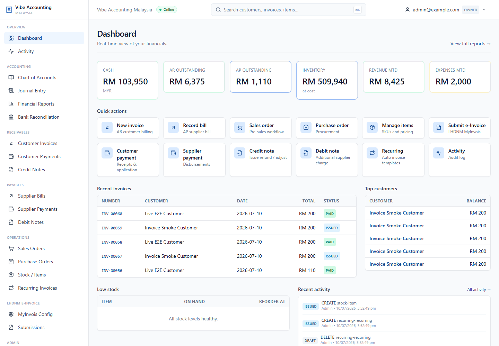
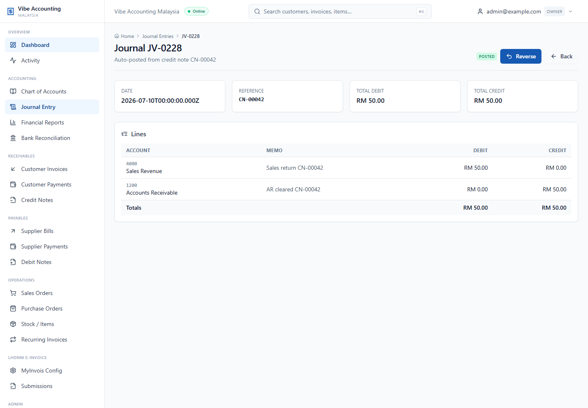
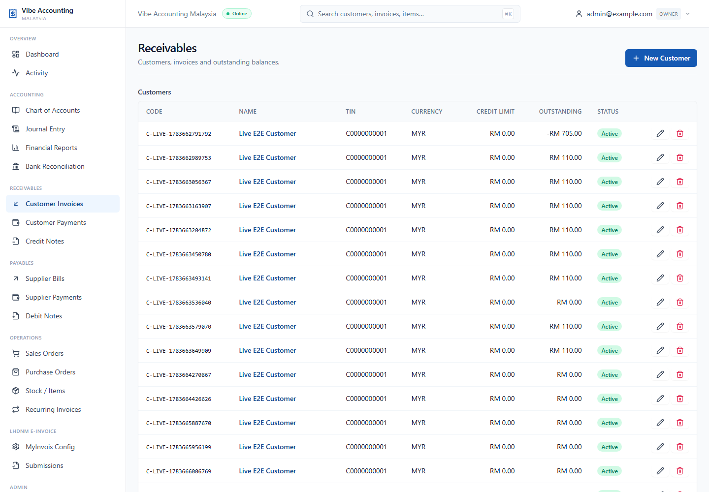
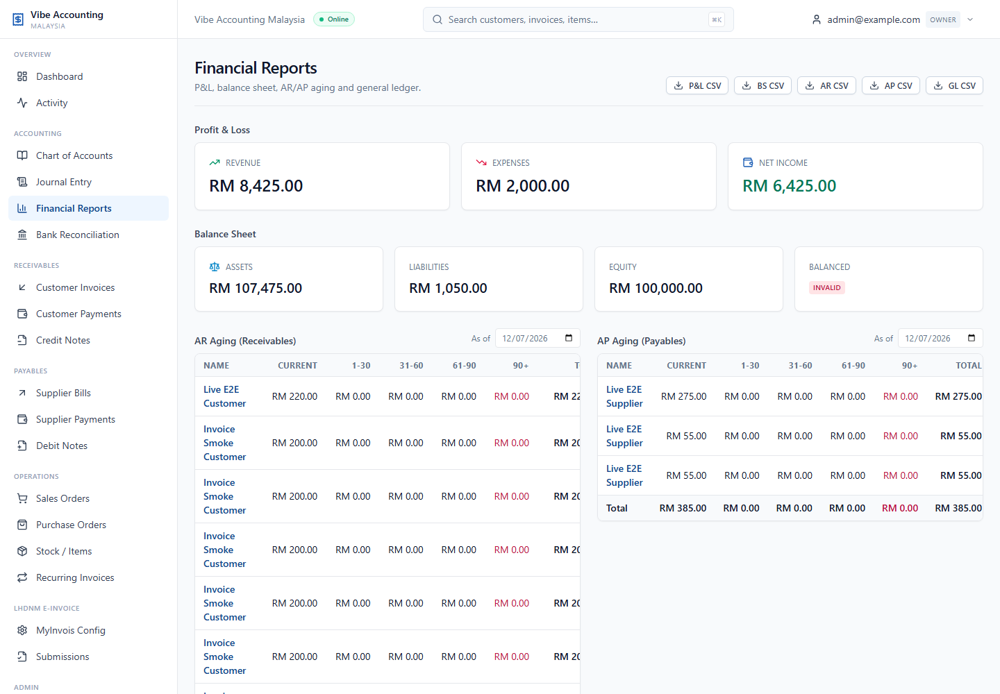

# Vibe Accounting Malaysia

Cloud-native accounting platform for Malaysian businesses. Built with
**NestJS + Prisma + PostgreSQL** on the back end and **Next.js** on the
front end, packaged as a self-contained Docker Compose stack.

> Reference: <https://sdk.myinvois.hasil.gov.my/> for LHDNM e-Invoice integration.
## Screenshots

### Dashboard



### Accounting workflows

| Journal entry | Customer receivables |
| --- | --- |
|  |  |

### Financial reports



## Highlights

- **Domain-complete accounting** — chart of accounts, tax codes, journals,
  AR / AP, sales & purchase orders, stock items.
- **MyInvois e-invoice integration** — X.509 PKCS#7 signing, UBL 2.1 JSON
  v1.1, OAuth2 client_credentials, SANDBOX + PRODUCTION environments,
  submission lifecycle (submit / poll / cancel).
- **Single published port** — only nginx :8080 is mapped to the host.
  Postgres and Redis live on the internal Docker network only.
- **Idempotent bootstrap seed** — the API auto-seeds a demo account book,
  chart of accounts, tax codes, demo customers / suppliers / items, an
  opening journal, and an `admin@example.com / ChangeMe!123` user.
- **Persistent state on the host** — Postgres files and uploads live
  under `infra/data/`, surviving `docker compose down` (no `-v`).
- **Clean Swagger docs** — visit `/api/docs` after starting the stack.
- **MyInvois UBL 2.1 v1.1** — full mapper for invoice, credit-note,
  debit-note, refund-note and self-billed variants with allowance/charge,
  MSIC code, multi-line address, contact (email/phone) and per-currency
  precision.  See [docs/einvoice.md](docs/einvoice.md) for the full
  reference.
- **Recurring invoices** — weekly/monthly/quarterly/yearly templates that
  auto-generate real customer invoices.
- **Customer & supplier payments** with automatic invoice application
  and GL post (DR/CR Bank, AR/AP).
- **Credit / debit notes** with auto-GL post (sales returns, supplier
  additional charges).
- **Audit log** — every key action is recorded for traceability.
- **Reports** — P&L, balance sheet, AR/AP aging, general ledger with
  per-account running balance.

## Modules

| Module            | Description                                                                  |
| ----------------- | ---------------------------------------------------------------------------- |
| `auth`            | JWT login, bcrypt password hashing                                           |
| `account-books`   | Multi-company support                                                         |
| `gl`              | Chart of accounts, journals, tax codes, fiscal years, trial balance, posting |
| `ar`              | Customers, AR invoices (with tax + line totals, **auto GL post**)            |
| `ap`              | Suppliers, AP bills (**auto GL post**)                                       |
| `sales`           | Sales orders + **convert-to-invoice** flow                                   |
| `purchase`        | Purchase orders                                                               |
| `stock`           | Items, stock movements, low-stock alerts                                     |
| `dashboard`       | KPI summary + quick actions                                                   |
| `reports`         | P&L, balance sheet, AR/AP aging, general ledger                               |
| `einvoice`        | MyInvois / LHDNM e-invoice submission + lifecycle + recent docs              |
| `payments`        | Customer & supplier payments with auto-GL post and invoice application       |
| `credit-notes`    | Credit notes (sales returns / refunds) with auto-GL post                     |
| `debit-notes`     | Debit notes (supplier additional charges) with auto-GL post                  |
| `bank-accounts`   | Cash & bank accounts linked to GL                                            |
| `recurring`       | Recurring invoice templates (weekly / monthly / quarterly / yearly)          |
| `audit-log`       | Entity-level activity feed                                                    |
| `health`          | Container / app liveness                                                      |
| `account-books`   | Workspace configuration (code, base currency, address)                        |
| `audit-log`       | Append-only audit trail (also exposed to the Activity Log UI)                |

## UI / UX

- **Detail pages** for every list entity (customer, supplier, sales order,
  purchase order, recurring template, stock item, journal entry, bank
  reconciliation, user, credit note, debit note, customer payment,
  supplier payment) — breadcrumbs, action shortcuts back to the parent
  workflow, and a system-wide audit-log Activity section. — breadcrumbs, action shortcuts back to the parent
  workflow, and a system-wide audit-log Activity section.
- **Toast notifications** (`useToast()`) fire on every mutation (success,
  warning, error, info) so users get immediate feedback without watching for
  list re-renders.
- **Skeleton loading** on the dashboard, journal detail, stock item detail,
  user detail and bank-reconciliation detail pages — avoids blank-screen flash.
- **Aging drill-down** — clicking an AR/AP aging row on `/reports` deep-links to the filtered customer / supplier invoices list; the 90+ bucket opens the worst-overdue invoice detail.
- **Deep linking** from list rows, audit log, search results, and dashboard
  cards into the matching detail page; the audit-log Activity section on every
  detail page links back to the originating user / entity.
- **Empty states** are explicit icons + descriptions + CTAs (not blank text).

## System-wide linking

Every list page deep-links to the related detail page; every detail page
exposes shortcut buttons back to the parent workflow:

- **Receivables** – invoices at `/receivables/[id]` with shortcut buttons
  for customer payment, credit note, e-Invoice validate / submit, audit
  activity, and live submission status (poll / cancel).
- **Payables** – bills at `/payables/[id]` with shortcuts for supplier
  payment and debit note.
- **Sales orders** – `/sales/[id]` with shortcut to create invoice.
- **Recurring templates** – `/recurring/[id]` with shortcut to run now, delete, and view upcoming due dates + activity.
- **Purchase orders** – `/purchase/[id]` with shortcut to record bill.
- **Books** – `/settings/books/[id]` shows currency, TIN/BRN, MSIC and quick counts of customers, suppliers, journals.
- **Fiscal years** – `/settings/fiscal-years/[id]` shows start/end/days/status with close / re-open actions and quick links to journal, GL and trial balance scoped to the period.
- **Tax codes** – `/settings/tax-codes/[id]` shows code, rate %, MyInvois taxTypeCode and description.
- **Bank accounts** – `/settings/bank-accounts/[id]` shows bank details, opening balance and shortcuts to reconcile, GL and dashboard.
- **Stock movements** – `/stock/movements/[id]` shows type, qty, unit cost, total and deep-links the underlying item.
- **Credit notes** – `/receivables/credit-notes/[id]` shows reason, totals, line items, related invoice and delete-reverses-GL action.
- **Debit notes** – `/payables/debit-notes/[id]` shows reason, totals, line items, related bill and delete-reverses-GL action.
- **Customer payments** – `/receivables/payments/[id]` shows amount, applied/unapplied, application table with deep-link to each invoice, audit activity and supplier/customer link.
- **Supplier payments** – `/payables/payments/[id]` shows amount, applied/unapplied, application table with deep-link to each bill, audit activity and supplier link.
- **Dashboard** – the "Recent activity" feed links each entity name to its
  detail page using the `entityHref()` helper.

Credit notes / debit notes / payments lists link their related invoice or
bill numbers to the underlying document.

The **Activity Log** page (`/audit-log`) supports combined `entity`,
`action` (CREATE / UPDATE / DELETE / POST / SUBMIT / CANCEL / POLL / PAY)
and `since` (date) filters with a one-click Clear button and matching CSV
export.


## Quick start

```powershell
cd C:\workspace\account
docker compose -f infra\docker-compose.yml up -d --build
```

Then open <http://localhost:8080> and sign in with
`admin@example.com` / `ChangeMe!123`.


## MyInvois (LHDNM e-Invoice) compliance highlights

- **State codes** are mapped from the customer's free-form state name to the
  ISO-3166-2:MY code per
  [sdk.myinvois.hasil.gov.my/codes/state-codes](https://sdk.myinvois.hasil.gov.my/codes/state-codes/)
  (01-17 with 17 = Not Applicable).
- **Tax type code** is carried on every TaxCategory (01..06 or E for
  exemption) per the MyInvois Tax Type table.
- **Document type codes** are emitted correctly for all 8 supported
  e-Invoice types: invoice (01), credit note (02), debit note (03),
  refund note (04), self-billed invoice (11), self-billed credit note (12),
  self-billed debit note (13), self-billed refund note (14).
- **Allowance aggregation** — LegalMonetaryTotal/AllowanceTotalAmount
  is computed from per-line discounts, satisfying the MyInvois validator.
- **Pre-submission validator** — POST /api/einvoice/invoices/:id/validate
  runs the in-process UBL validator without contacting MyInvois. UI
  surfaces a green/red badge before users click Submit.

## Accounting automation

- **Automatic GL posting** — every customer invoice or supplier bill
  generates a balanced journal entry (DR Accounts Receivable / CR Sales
  + CR SST; DR Purchases + DR Input Tax / CR Accounts Payable).
  Posting is wrapped in a try/catch so missing GL accounts never roll
  back the source transaction; the warning is logged instead.
- **Sales order -> invoice** — POST `/api/ar/sales-orders/:id/convert-to-invoice`
  converts a sales order into a customer invoice and closes the SO.
- **Fiscal years** — journals can only be posted to an open fiscal year;
  the bootstrap seed creates the current and next year automatically.
  POST /api/gl/fiscal-years/:id/close and /reopen let you lock a
  period from the UI or API.
- **Journal reversal** — POST /api/gl/journals/:id/reverse creates a
  counter-posting that flips every line's debit & credit, marks the
  original entry REVERSED, and keeps the trial balance intact.

## GL endpoints

- `GET    /api/gl/trial-balance?asOf=YYYY-MM-DD` – debit / credit per
  account (defaults to today).
- `POST   /api/gl/journals/:id/reverse` – flip every line, mark original
  `REVERSED`, create a counter-posting.
- `POST   /api/gl/fiscal-years/:id/close` – block future postings.
- `POST   /api/gl/fiscal-years/:id/reopen` – re-open a closed period.

All four endpoints are documented in Swagger at `/api/docs` (with
`@ApiOperation` and `@ApiResponse` annotations).

## MyInvois SDK coverage

In addition to state codes, tax types, document types and allowance
aggregation, the mapper and config module also expose:

- `PAYMENT_MODE_CODES` – the full MyInvois PaymentMeans list (01-10:
  Cash, Cheque, Bank Transfer, Credit/Debit Card, e-Wallet, Direct Debit,
  FPX, e-Money, Online Payment) plus `paymentModeDisplayName()` helper
  to render the human-readable label in the UI.

## Tests

- **Unit tests** (
px jest in pps/api) — 164 tests across 23 suites
  covering the GL / AR / AP / einvoice / stock / bank-accounts / recurring /
  reports / credit-notes / auth services plus the UBL mapper, UBL validator,
  MyInvois HTTP client, payments (customer + supplier), debit notes,
  sales orders, purchase orders, AP service, audit log (+ CSV escape rules).
- **Live e2e tests** (
px jest --config ./test/jest-e2e.json) — run
  against a running stack; require the seeded admin user.

## Highlights of recent hardening
  the bootstrap seed creates the current and next year automatically.

## Tests

- **Unit tests** (
px jest in pps/api) — 164 tests across 23 suites
  covering the GL / AR / AP / einvoice / stock / bank-accounts / recurring /
  reports / credit-notes / auth services plus the UBL mapper, UBL validator
  and MyInvois HTTP client.
- **Live e2e tests** (
px jest --config ./test/jest-e2e.json) — run
  against a running stack; require the seeded admin user.

## Highlights of recent hardening

```bash
# Build the API test image and run unit tests
docker build -f apps/api/Dockerfile --target tester -t vibe-accounting-malaysia/api-test .
docker run --rm vibe-accounting-malaysia/api-test
```


> **CI**: A GitHub Actions workflow is provided in `.github/workflows/ci.yml`
> (build + unit tests + smoke test).  Some Personal Access Tokens lack the
> `workflow` scope required to push workflow files to GitHub; in that case
> the file lives in your local checkout and CI runs from your own runner.

## Documentation

- [docs/architecture.md](docs/architecture.md) — system architecture,
  database schema, container layout
- [docs/einvoice.md](docs/einvoice.md) — MyInvois / LHDNM integration,
  signing, UBL 2.1 JSON shape, status codes
- [docs/operations.md](docs/operations.md) — backup, restore, reset, lifecycle
- [docs/development.md](docs/development.md) — local development, tests,
  adding modules

## Scripts

| Script                          | Purpose                              |
| ------------------------------- | ------------------------------------ |
| `scripts/up.{ps1,mjs}`          | Start the stack                      |
| `scripts/down.{ps1,mjs}`        | Stop the stack                       |
| `scripts/status.{ps1,mjs}`      | Container status + data volume size  |
| `scripts/backup.{ps1,mjs}`      | Snapshot `infra/data/`               |
| `scripts/restore.{ps1,mjs}`     | Restore a snapshot                   |
| `scripts/reset.{ps1,mjs}`       | DESTRUCTIVE wipe of all data         |
| `scripts/probe-myinvois.{ps1,mjs}` | Fetch live MyInvois SDK docs       |

## Repo layout

```
apps/
  api/        NestJS REST API (Prisma, JWT, Swagger)
  web/        Next.js front end (App Router, Tailwind, react-hook-form)
packages/
  shared/     Shared TypeScript types
infra/
  docker-compose.yml
  nginx/      Reverse proxy (only published port 8080)
  data/       Bind-mounted volumes (postgres, uploads, backups)
  postgres/init/
scripts/      Operational + dev scripts
docs/         architecture, operations, einvoice, development
```

## License

Private / internal.
